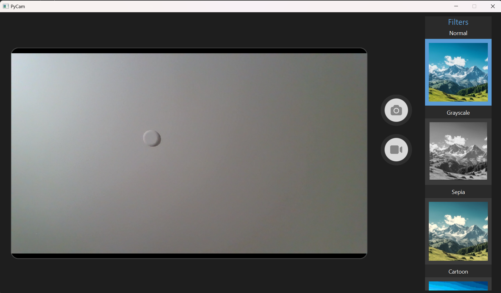

<h1>
  
  Camtopy
</h1>

`Camtopy` is a desktop Camera application built entirely with python, designed to provide basic Camera functionality with some fun filters.

### ✨Features:
- 📷 Photo Capture – Take snapshots with your webcam.
- 🎥 Video Recording – Record videos.
- 🎨 Filters – Apply live filters like Grayscale, Sepia, Cartoon, and Blur.

### Technology/Libraries:
- OpenCv: Image and video capture
- sounddevice: Audio recording
- ffmpeg: Merge Audio with video recording
- PyQt: Used to create a UI

### User Interface:

 

### Demo:

